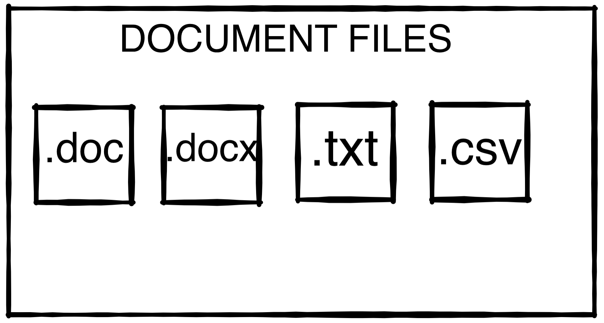
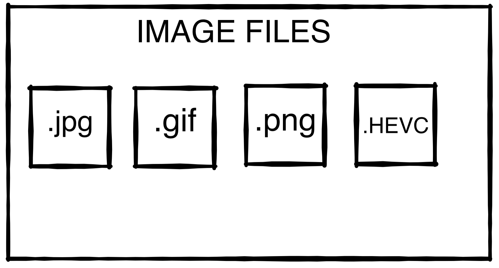
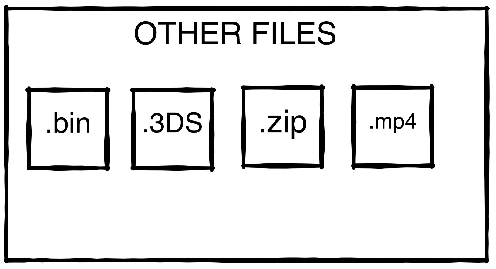

# Smart-Files


Thank you for your interest in Smart Files! The purpose of this program is to automate the movement of files that slowly but surely build up in your Downloads folder. As simple a task as it is, we all know it's a chore that would just rather not be done.

What our program does once you install it is it will move the files by extension into folders that match that group. 

For example. If I have a ton of .png and .jpg files in my downloads folder, I can use the command `smart-files run` and our program will automatically move those files into a _media_ folder.

Or lets say I'm trying to download a thing from a website and macOS has already downloaded the .zip file and in my frustration of the installation not automatically starting I accidentally download the .zip file exactly one million times? I could use smart files to move all those files automatically into a _software_ or _other_ folder to keep my downloads file clean. Or what if you just don't have time to go into your downloads folder and move the files and the size just builds up over time?

`smart-files run` works ad hoc, but that's still a manual process, isn't it? Which is why we've added time commands as well. We've utilized cron for Unix and Linux to move files based on frequency commands per minute, hour, day, and month. This will create a _cronjob_ in your _crontab_ based on which command you give it.

This program takes away the hassle of having to deal with the mess and reduces the clutter. 

## Instructions


## IMPORTANT

We discovered while developing this project that macOS's security protocols will block access to cron trying to make changes but won't alert you. In order for smart-files to do its job, you need to give full disk access to cron. Please follow the instructions below

For Mac ver. 10.15.6 or greater:

1. In order for this module to work properly, we need to grant full-disk access for `cron` upon installation

2. Open Finder and on the top-left corner of the screen, click "Go" and select “Go to folder"

3. Insert this to location: `/usr/sbin/cron` 

4. Select "Go" and locate `cron`

5. Go to System Preferences and then to Security and Privacy

6. Navigate to Full Disk Access and click the lock at the bottom left to unlock

7. Drag `cron` from finder to the list of apps in Full Disk Access. Ensure `cron` is checked prior to closing the window. 


### Add Scheduled Sorting Job
1. Run `smart-files cron` to display job frequency options. The result is displayed below:
```
Options:
-m, --minutes  Will create a cron job for Smart-files to run every minute
-h, --hour     Will create a cron job for Smart-files to run every hour
-d, --day      Will create a cron job for Smart-files to run once every day
-o, --month    Will create a cron job for Smart-files to run once a month
--help         Show this message and exit.
```
2. Add the desired command at the end of `smart-files cron`
3. For example, the command for running smart-files every minute would be `smart-files cron -m`
4. Verify that the crontab job exists by running the command `crontab -l`
> Note: Running a new smart-files job will overwrite the old smart-files job.
### Sort Files
To sort files on an ad hoc basis:
1. Run `smart-files run`
2. Check Downloads folder and verify that the files are sorted to their respective folders. 

### Display Unsorted Files
To display unsorted files:
1. Run `smart-files show-files`
2. The files displayed are coming from the Downloads folder, excluding the folders smart-files creates


### Developers: Ashley Casimir, Sean Hawkins, Ben Hill, Karlo Mangubat


## Domain model


## Wire frame




